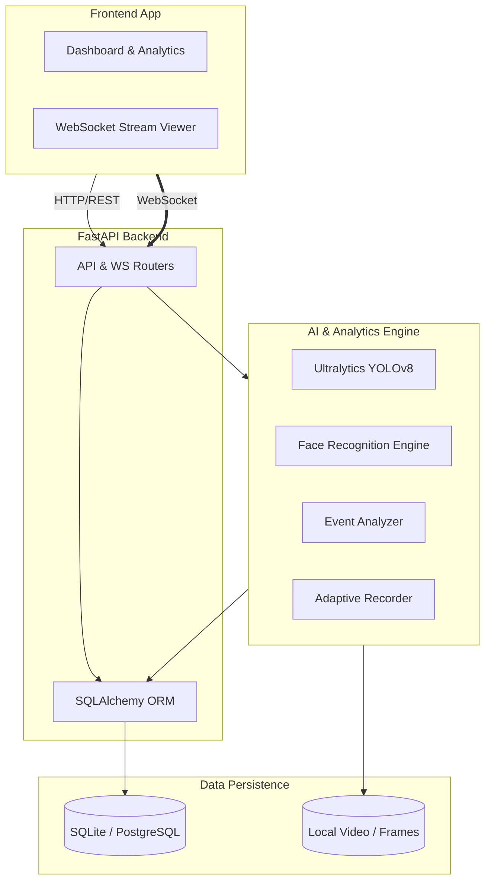

# 👁️ AI-Powered Intelligent Surveillance System

> An enterprise-grade, real-time video analytics platform built to detect, track, and analyze objects and individuals using state-of-the-art computer vision models.


## 📖 Overview

The **AI-Powered Intelligent Surveillance System** is a full-stack solution designed to transform passive video feeds into actionable intelligence. By leveraging deep learning models (YOLOv8) and face recognition algorithms, the system can automatically identify objects, detect specific events (e.g., crowding, appearances, loitering), and manage suspect profiles in real time. 

Built with scalability and performance in mind, it features an **adaptive frame-recording mechanism** to optimize storage without losing critical anomaly footage, and a **WebSocket-driven React frontend** for instantaneous live-stream monitoring.

## ✨ Key Features

- **Real-Time Object Detection**: Integrated YOLOv8 for high-accuracy, low-latency detection of people, vehicles, and custom objects.
- **Facial Recognition**: Matches faces against a centralized suspect database to trigger immediate alerts.
- **Smart Event Analysis**: Automatically logs events like person appearances, departures, crowding, and unauthorized objects.
- **Adaptive Recording**: Dynamically drops uninteresting frames to save storage space while maintaining high fidelity during critical events.
- **Live Video Streaming**: Low-latency WebSocket streaming to the client dashboard.
- **Interactive Dashboard**: Built with modern React and Recharts for visualizing event timelines, alert metrics, and zone statistics.

## 🏗️ System Architecture & Design

The system follows a modern, decoupled client-server architecture, enabling high throughput and independent scaling of the AI inference engine and the user interface.



### 🧠 Core Design Principles
1. **Asynchronous Processing**: FastAPI's async capabilities handle heavy video I/O and concurrent AI inference requests efficiently.
2. **Modular AI Pipeline**: Detection, recognition, and recording are decoupled services, allowing easy swapping of models (e.g., upgrading from YOLOv8 to a newer architecture).
3. **Optimized Storage Management**: The `Adaptive Recorder` drastically reduces disk usage by intelligently deciding which frames contain semantic value.

## 🛠️ Technology Stack

| Layer | Technologies |
|---|---|
| **Frontend** | React 18, Vite, Tailwind CSS, Zustand (State Management), Recharts |
| **Backend** | Python, FastAPI, SQLAlchemy, WebSockets, Uvicorn |
| **AI / Vision** | OpenCV, Ultralytics (YOLOv8), `face_recognition`, PyTorch |
| **Database** | SQLite (Development), Production-ready ORM structure for PostgreSQL |

## 🚀 Quick Start

### 1. Backend Setup
```bash
cd backend
python -m venv venv
source venv/bin/activate  # On Windows use: venv\Scripts\activate

# Install dependencies
pip install -r requirements.txt

# Environment setup
cp .env.example .env

# Initialize database
python ../scripts/init_db.py

# Start the server
uvicorn app.main:app --reload --port 8000
```
> The API documentation (Swagger UI) will be available at `http://localhost:8000/docs`

### 2. Frontend Setup
```bash
cd frontend

# Install dependencies
npm install

# Start the development server
npm run dev
```
> The web application will be accessible at the address provided by Vite (usually `http://localhost:5173`).

## 📂 Project Structure

```text
surveillance-system/
├── backend/
│   ├── app/
│   │   ├── api/routes/          # RESTful endpoints & WebSockets
│   │   ├── core/                # Configuration and DB session setup
│   │   ├── models/              # SQLAlchemy Database Models
│   │   ├── schemas/             # Pydantic validation schemas
│   │   └── services/            # Core business logic (AI, YOLO, Recording)
│   └── scripts/                 # Utility scripts (DB initialization)
└── frontend/
    ├── src/
    │   ├── pages/               # React views (Dashboard, LiveStream, etc.)
    │   ├── services/            # Axios API clients
    │   ├── store/               # Zustand global state management
    │   └── hooks/               # Custom React hooks (e.g., useStream)
    └── tailwind.config.js       # UI Styling configuration
```

## 🔮 Future Roadmap
- [ ] **Loitering Detection**: Track dwell time per zone to flag suspicious behavior.
- [ ] **Restricted Area Breach**: Polygon-based zone definitions triggering on entry.
- [ ] **Automated Alerts**: Email and Webhook integrations for external notifications.
- [ ] **Multi-Camera Grid**: Support for scaling to multiple simultaneous IP camera feeds.

---
*Designed with an emphasis on code quality, modularity, and real-world applicability.*
